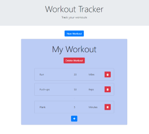

# Workout Tracker
[](https://lbesson.mit-license.org/)



## Description
Workout Tracker allows you to easily track your workouts. Featuring a clean and intuitive design it allows you to easily add, edit, and delete workouts. All workouts are stored in a MongoDB database, so they'll be there whenever you need them. Workout Tracker makes use of dynamically generated HTML to improve the user experience by doing nearly all database requests behind the scenes, thus minimizing page reloads. The site is deployed at: https://eb-workout-tracker.herokuapp.com/

## Table of Contents
* [Installation](#Installation)
* [Usage](#Usage)
* [License](#License)
* [Questions](#Questions)

## Installation
To install necessary dependencies, run the following command:
```
npm i
``` 

## Usage
This site uses a MongoDB instance to store data. If you would like to download and run it locally, make sure you have MongoDB installed on your computer.

## License
[](https://lbesson.mit-license.org/) 

This application is covered by the MIT license.

## Questions
Find all of my repos at elijah415hz. 

Please email me at elijahblaisdell@gmail.com with any questions.
